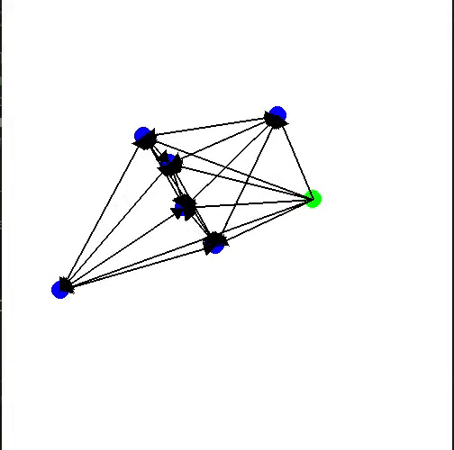

# Multi-Robot Consensus Package
[](http://wiki.ros.org/ROS/Installation)
[](https://www.python.org/downloads/)

This package provides a robust framework for simulating consensus algorithms in multi-robot systems. Leveraging graph theory and advanced coordination protocols, it enables efficient swarm control, including rendezvous, formation control, and obstacle avoidance. This documentation guides you through installation, configuration, running simulations, and customizing the package to suit various scenarios.

<table>
  <tr>
    <td>
      
      <p>Hexagon Formation with Steer-to-avoid</p>
    </td>
    <td>
      
      <p>Rectangle Formation with Steer-to-avoid</p>
    </td>
  </tr>
</table>

__Note__: The blue circles are current agent positions while the purple circles are desired agent positions (relative to the defined formation). The green edges represent agent-agent communication lines. The result on the left shows a sparse graph with a spanning tree while the result on the right shows a fully-connected graph. Finally, the black objects are obstacles. 

## Table of Contents

- [Installation](#installation)
- [Configuration Guide](#configuration-guide)
- [Running Simulations](#running-simulations)
- [Customization](#customization)
- [Visualizing Results](#visualizing-results)
- [Further Documentation](#further-documentation)
- [Contributing](#contributing)
- [License](#license)
- [Authors](#authors)

## Installation

1. **Dependencies**: Ensure ROS (Robot Operating System) and Python 3 are installed on your system. Additionally, this project uses the 2D [Stage](https://github.com/rtv/Stage) simulator, so the bindings for ROS ([stage_ros](http://wiki.ros.org/stage_ros)) should be installed, alongside the map server. Run the following commands:
   ```bash
   sudo apt install -y \
      ros-${ROS_DISTRO}-map-server \
      ros-${ROS_DISTRO}-stage-ros
   ```
    Replace `${ROS_DISTRO}` with your ROS distribution (e.g., `noetic`, `melodic`, etc.).

  * Additionally, install the following packages for the simulating the sphero robots in the stage simulator:
    ```bash
    cd <your_workspace>/src
    git clone https://github.com/larics/sphero_simulation.git
    catkin build
    ```
2. **Clone the Repository**: Clone this repository into your ROS workspace's `src` directory.
   ```bash
   cd <your_workspace>/src
   git clone git@github.com:MosesEbere/multi-robot-consensus.git
   ```
3. **Build the Package**: From the root of your ROS workspace, build the package using `catkin build`.
   ```bash
   cd <your_workspace>
   catkin build
   ```
4. **Source the Workspace**: Source your ROS workspace to make the package available.
   ```bash
   source devel/setup.bash
   ```

## Configuration Guide

The configuration file, named `params.yaml`, serves as the central hub for customizing the behavior, tasks, and parameters of the multi-robot system. Below, we delve into each segment of the configuration file, providing clear explanations and examples for each parameter.

### General Structure

The configuration file is organized into several sections, each pertaining to different aspects of the simulation:

- **Task Definition**
- **Robot Formations**
- **Stubborn Nodes**
- **Communication Settings**
- **Obstacle Avoidance**
- **Behavior Weights**
- **Separation Behavior**
- **Prioritized Acceleration**
- **Simulation Parameters**

### Task Definition

This section specifies the primary task for the robot swarm. Valid tasks include `formation_consensus`, `rendezvous`, and others you might implement.

```yaml
task: 'formation_consensus'
```

### Robot Formations

Configure the initial and final formations for the robot swarm. Common formation types are `circle`, `random`, and `triangle`, but you can extend this with custom formations.

- **Initial Formation**:
  - `shape`: The geometric shape of the formation (e.g., `circle`, `random`).
  - `n`: Number of agents.
  - `r`, `origin`: Radius and origin for circle formations.

```yaml
init_formation:
  init_formation: 'random'
  n: 6
  r: 4
  origin: [0,0]
```

- **Final Formation**:
  Similar to initial formation, but specifies the desired end-state formation of the swarm. The package supports various formation shapes, including `triangle_formation`, `line_formation`, `square_formation`, `circle_formation`, and `polygon_formation`, which are implemented in the `Formation` class in `init_pos.py`. You can extend this class to include more formation types. Note that the implemented formation types all end in `_formation`. Below is an example of a triangle formation.

```yaml
final_formation:
  shape: 'triangle_formation'
  center: [0, 0]
  start: [0, 0]
  spacing: 1.0
  radius: 4
  visualize: True
```

As shown above, the `final_formation` section specifies the desired formation shape, center, start, spacing, radius, and visualization settings. The `spacing` parameter is used to define the distance between agents in the __line__, __square__, and __triangle__ formations along with the `start` to determine where to start from. On the other hand, the `radius` is used for the __circle__ and __polygon__ formations. This is used with the `center` to determine the center of the formation.

The `visualize` parameter allows you to visualize the desired final formation in RViz for comparative analysis. For now, this visualization is performed by taking a reference robot agent and plotting the desired formation around it. This is a plausible approach for visualizing the formation, but a more comprehensive method would be more ideal.

### Stubborn Nodes

Introduce stubborn agents into the simulation, specifying their behavior, number, positions, and how they connect to the rest of the swarm. For multiple stubborn agents, use a list of lists to positions of all the agents. The `connection` parameter allows you to define the communication modality of the pinning agent. See the example below for a single stubborn agent. Other parameters (such as multigoal definition) are also available in the configuration file.

```yaml
stubborn_nodes:
  k: 1
  pos: [3, -2.5]
  connection: [-1]  # Connect to all agents by default. Use specific indices to limit connections.
  motion_type: 'circular'
```

To see the influence of stubborn agents, you can set the `motion_type` to `circular` and observe how the stubborn agent affects the swarm's behavior. Currently, the package supports `circular` and `lawnmower` motion types but can be extended (in the `StubbornAgent` class in `stubborn_agent.py`) to include more.

### Communication Settings

Defines the communication range and field of view for agents, affecting how they interact and form connections.

```yaml
comm_range: 10.0
comm_theta: 360.0  # Field of view in degrees.
switching_topology: True  # Allow dynamic updating of the communication graph.
```

### Obstacle Avoidance

Selects the method for obstacle avoidance and configures relevant parameters. The package currently supports two methods:

- **Steer to Avoid**: `steer_to_avoid.py`
- **Potential Field**: `potential_field.py`

The selection is based on the `priority_list` parameter. Defining either method activates it for the simulation. Below are obstacle avoidance parameters.

```yaml
obstacle_radius: 0.8
step_angle: 0.174533
max_steering_angle: 6.28
```

### Behavior Weights

This section defines the relative importance or weights of different behaviors that agents exhibit during the simulation. Adjusting these weights allows you to prioritize certain behaviors over others, affecting the overall dynamics of the swarm.

```yaml
weights:
  separation: 0.5
  formation: 1.0
  steer_to_avoid: 0.5
```

- **separation**: Determines how strongly agents try to maintain a minimum distance from each other to avoid collisions.
- **formation**: Indicates the importance of maintaining the desired formation shape.
- **steer_to_avoid**: Reflects the priority of avoiding obstacles over other behaviors.

### Separation Behavior

Configures the parameters guiding how agents avoid colliding with each other by maintaining a minimum distance apart.

```yaml
separation:
  repulsion_strength: 1.0
  threshold: 0.8  # A percentage of the formation radius/spacing.
```

- **repulsion_strength**: Controls the intensity of the force applied to keep agents separated.
- **threshold**: Sets the distance (as a percentage of the formation radius or spacing) at which separation forces become active.

### Prioritized Acceleration

Enables or disables the prioritized acceleration mechanism, which determines how different behavioral forces (e.g., for separation, formation, and obstacle avoidance) are combined when they conflict. As the name suggests, this mechanism prioritizes the most important behaviors when agents need to reconcile conflicting forces. The `priority_list` specifies the order and relative importance of behaviors when their forces need to be combined. The prioritization is based on the weights defined earlier and is regulated by the max/min acceleration of the agents.

```yaml
use_prioritized_acc: False
priority_list:
  - '_formation': 1.0
  - '_separation': 0.5
  - '_steer_to_avoid': 0.5
```

- **use_prioritized_acc**: A boolean flag to enable or disable prioritized acceleration.
- **priority_list**: A list specifying the order and relative importance of behaviors when their forces need to be combined. This list directly uses the weights defined earlier but can be adjusted here to set specific priorities when behaviors conflict.

### Simulation Parameters

General simulation settings such as velocity scaling, kinematic constraints, and visualization options.

```yaml
scale_vel: 0.1
max_speed: 3.3
max_acc: 2.2
visualize: True
visualize_traj: True
truncate_trajectories: 100
```

### Customizing Configurations and Behavior Interactions

To customize your simulation of the multi-robot system to specific scenarios or objectives, modify the values in the `params.yaml` file. Here are a few tips:

- **Experiment with Different Formations**: Changing `shape` and `n` in the formation settings allows you to test how different formations affect consensus tasks.
- **Adjust Communication Parameters**: Tweaking `comm_range` and `comm_theta` can simulate different sensor capabilities and environmental constraints.
- **Incorporate Obstacle Avoidance**: Depending on your simulation environment, select an obstacle avoidance strategy that best fits the scenario.
- **Balancing Separation and Formation**: Increase the `separation` weight to prioritize avoiding agent collisions in densely populated environments, or boost the `formation` weight to maintain strict formation shapes.
- **Managing Obstacle Avoidance**: Adjust the `steer_to_avoid` weight to navigate more complex environments with numerous obstacles.
- **Utilizing Prioritized Acceleration**: Enable `use_prioritized_acc` and configure the `priority_list` to fine-tune how agents reconcile conflicting behaviors, ensuring smooth and efficient movement.

These sections provide powerful tools for controlling the nuanced interactions between different agent behaviors, allowing for extensive customization of the swarm's collective dynamics based on the simulation's requirements. By carefully tuning these parameters, you can explore a wide range of scenarios and behaviors within the multi-robot consensus framework.

## Running Simulations

To run a simulation, use the provided launch files. For instance, to start a simulation with the default configuration:

1. Go to the `stage_simulator` launch yaml file (i.e., in `<your_workspace>/src/sphero_simulation/sphero_stage/launch`) and change the number of robots to the desired value.

2. Go to the `params.yaml` file (i.e., in `<your_workspace>/src/multi-robot-consensus`) and change the number of boids (i.e., k + n) to the same value as the above.

3. Spawn the robots in the Stage Simulator:
    ```bash
    rosrun sphero_stage start.py
    ```
4. The robots will be spawned in Stage in the predefined formation (as defined in the launch yaml file of the simulator).

5. Launch the formation control node:
    ```bash
    roslaunch multi-robot-consensus formation_ctl.launch
    ```

## Customization

### Adding Custom Formations

Implement new formations by extending the `Formation` class in `init_pos.py`. For instance, add a hexagon formation method and reconfigure the consensus task to use it.

### Custom Motion Patterns

Modify the `StubbornAgent` class to introduce new motion patterns for stubborn agents. For example, add a `spiral_motion` method for a spiral pattern.

## Obstacle Avoidance

The package includes two obstacle avoidance mechanisms:

- **Steer to Avoid**: Activates a dynamic steering adjustment to navigate around obstacles.
- **Potential Field**: Generates a potential field for global obstacle avoidance.

Select the preferred method in `formation_ctl.py` and configure its parameters in `params.yaml`.

## Visualizing Results

Visualize simulation results in real-time using ROS RViz. The main node publishes the robot positions and desired formations, allowing you to monitor the swarm's behavior and formation dynamics. You can also visualize the robot trajectories and the desired formation shape.

### Example Visualization

### Some results from PyGame
<table>
  <tr>
    <td>
      
      <p>Line Formation</p>
    </td>
    <td>
      
      <p>Line Formation</p>
    </td>
  </tr>
  <tr>
    <td>
      
      <p>Circle Formation</p>
    </td>
    <td>
      
      <p>Rectangle Formation</p>
    </td>
  </tr>
  <tr>
    <td>
      
      <p>Hexagon Formation</p>
    </td>
  </tr>
</table>

#### Shape Formation
<table>
  <tr>
    <td>
      
      <p>Circle Formation</p>
    </td>
    <td>
      
      <p>Triangle Formation</p>
    </td>
  </tr>
  <tr>
    <td>
      
      <p>Septagon Formation</p>
    </td>
    <td>
      
      <p>Septagon Formation with Real-time Scaling</p>
    </td>
  </tr>
</table>

#### Multi-Goal Formation with a Pinned Agent
The red circle represents the pinned agent, while the blue circles represent the normal (consensus-abiding) agents. The pale yellow circle represents the goal of the pinned agent. The green lines show the communication links between the robots.
<table>
  <tr>
    <td>
      
      <p>Line Formation</p>
    </td>
    <td>
      
      <p>Dynamic Formation</p>
    </td>
  </tr>
</table>

#### Including Obstacle Avoidance
The purple circles show the desired formation (desired robot positions), while the blue circles show the actual formation (actual robot positions). The black objects are the obstacles in the environment. The green lines show the communication links between the robots. 
<table>
  <tr>
    <td>
      
      <p>Square Formation with Steer-to-avoid</p>
    </td>
    <td>
      
      <p>Line Formation with Steer-to-avoid</p>
    </td>
  </tr>
  <tr>
    <td>
      
      <p>Hexagon Formation with Steer-to-avoid</p>
    </td>
    <td>
      
      <p>Rectangle Formation with Steer-to-avoid</p>
    </td>
  </tr>
</table>

#### Effect of Changing the Communication Topology
<table>
  <tr>
    <td>
      
      <p>Triangle Formation</p>
    </td>
    <td>
      
      <p>Hexagon Formation</p>
    </td>
  </tr>
</table>

## Further Documentation
Script-specific documentation is available in the `docs` directory. For instance: 
- [Stubborn Agent Behavior](docs/stubborn_agent.md) - `stubborn_agent.py`
- [Pose Message Transformation](docs/state_tf.md) - `state_tf.py` 
- [Formation Control](docs/formation_ctl.md) - `formation_ctl.py` 
- [Potential Field](docs/potential_field.md) - `potential_field.py`
- [Formation Initialization](docs/init_pos.md) - `init_pos.py`
- [Steer to Avoid](docs/steer_to_avoid.md) - `steer_to_avoid.py`
- [Graph](docs/Graph.md) - `Graph.py`
- [utils](docs/utils.md) - `utils.py`

## Contributing
Contributions to this repository are welcome. Some of the ways to contribute to this repository are:

- Create new formation types and add them to the `Formation` class in the `init_pos.py` file.
- Implement a method to fuse the maps generated by each robot to create a comprehensive map of the environment.
- Add support for different robot models and types (e.g., differential drive robots), as well as other simulators.
- Implement other motion patterns for stubborn agents, such as zigzag, figure-eight, random walk, etc.

## Actionable Items/ Dev Notes
#### stubborn_agent.py
1. The normalize_positions method in the StubbornAgent class may not be working as expected.
2. The lawnmower_motion method in the StubbornAgent class may not be working as expected.

#### init_pos.py
1. For the polygon and circle formations, if the number of stubborn agents is 1, the center of the polygon/circle is added as a stubborn agent.
2. - The square formation is in fact a rectangle formation. The number of agents is used to determine the number of rows and columns in the rectangle.
3. The distribute_stubborn method was added to distribute stubborn agents around the center of the formation; however, it may not be working as expected.

#### formation_ctl.py
1. Final formation and scale velocity parameters are now included in the initialization of the Reynolds class.
2. The get_desired_formation method was added to get the desired formation based on the final formation parameters 
    - parameters are controlled from the config file.
3. The shape_function method was added to dynamically call the formation method to get the desired formation.
4. The normalize_positions method was added to normalize positions to fall within the map dimensions specified during initialization.
5. The task_function method was added to dynamically call the graph method to get the desired task.
6. The run method was modified to perform the task and update the stubborn nodes' goals if there are any.
7. Since we need velocities instead of positions to move the stubborn agents, the old positions are stored and with the new positions from the update_goal method, the velocities are calculated (using scale * (new position - old position)) and published.
8. We were previously using the position generated by the stubborn agent class to update the position of the stubborn agent in the graph. This was wrong.
    - We should use the position generated by the stubborn agent class to update the velocity ONLY of the stubborn agent in the graph.

#### Graph.py
1. random and circle topologies are used only when there are no stubborn agents.
2. Only a copy of None positions is sent to the stubborn agent class to avoid unwanted changes to the original positions.
3. The line to append the stubborn agent to the list of stubborn nodes was commented out to avoid appending the stubborn agent multiple times (already done in formation_ctl).
4. The graph_init attribute (added to check whether the graph has been initialized) was extended to work with NumPy arrays.

#### params.yaml
1. final_formation was added to handle the case where the agents are to be placed in a specific formation at the end of the task.
2. stubborn_nodes was added to handle the case where some agents are stubborn and move at will.
3. scale_vel was added to scale the velocity of the agents - a better solution may be required. Max_speed and max_acc?

#### formation_ctl_hardstop_stubborn.py
1. The hardstop method was added to stop the stubborn agent when it reaches its goal. This is because there remains some conflict with the obstacle avoidance method causing the robots to keep moving (oscillating) even after reaching their goals.

## License

This project is licensed under the MIT License - see the [LICENSE](LICENSE) file for details.

## Acknowledgments

- The [LARICS team](https://github.com/larics) at the University of Zagreb for the Sphero simulation package.

## Authors:

- [Moses Ebere](https://github.com/MosesEbere)
- [Joseph Adeola](https://github.com/AdeolaJoseph)
- [Khawaja Alamdar](https://github.com/KhAlamdar11)
- [Nada Abbas](https://github.com/NadaAbbas444)
